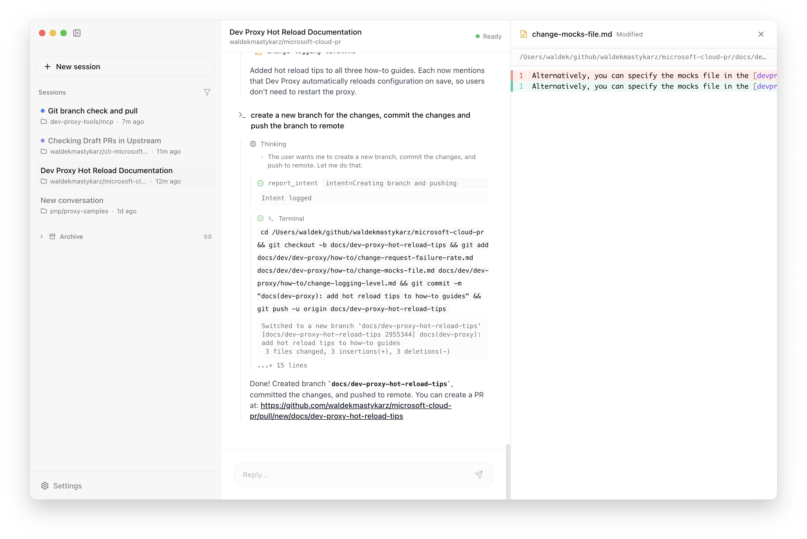

# Accrew

One app to manage AI coding agents across all your projects.



Stop juggling terminal windows. Accrew gives you a unified command center where you can talk to agents, see their reasoning, watch file changes in real-time, and switch between projects without losing context.

## Why Accrew?

- **Multi-project workflow** — Switch between workspaces mid-thought. `@backend fix the auth bug` then `@frontend update the login form`
- **See the thinking** — Watch agent reasoning unfold, not just the final answer
- **Inline diffs** — Every file change rendered as a diff, instantly reviewable
- **Session persistence** — Pick up where you left off. Every conversation saved in SQLite
- **Smart routing** — Say "check the todo app" and Accrew figures out which workspace you mean

## Prerequisites

- **GitHub Copilot subscription** — active Copilot Individual or Business plan
- **[Copilot CLI](https://docs.github.com/en/copilot/managing-copilot/configure-personal-settings/installing-the-github-copilot-extension-in-your-environment)** — installed and signed in (`copilot auth login`)
- **[Node.js](https://nodejs.org/)** — required to run the Copilot CLI subprocess. Accrew is an Electron app and needs a standalone Node.js binary on the system (Electron's bundled runtime can't be used for subprocesses). Default path: `/opt/homebrew/bin/node` (macOS/Homebrew). Configure in Settings if Node.js is installed elsewhere.

## Quick Start

1. Download the [latest release](https://github.com/waldekmastykarz/accrew/releases)
2. Open `Accrew.app`
3. Start chatting — auth is automatic via GitHub Copilot CLI

> **Tip:** If messages stay stuck at "Thinking...", check that the Node.js path in Settings points to a valid `node` binary.

## Configuration

Settings stored in `~/.accrew/config.json`:

```json
{
  "workspaceFolder": "~/github",
  "model": "claude-opus-4-5",
  "nodePath": "/opt/homebrew/bin/node",
  "diffFont": "ui-monospace",
  "diffFontSize": 13,
  "sidebarWidth": 256
}
```

| Key | Description | Default |
|-----|-------------|---------|
| `workspaceFolder` | Root folder containing your projects | `~/github` |
| `model` | LLM model for agent responses | `claude-opus-4-5` |
| `nodePath` | Path to Node.js binary (used to spawn Copilot CLI) | `/opt/homebrew/bin/node` |
| `diffFont` | Font for diff viewer | `ui-monospace` |
| `diffFontSize` | Font size for diff viewer | `13` |

## Usage

**Target a workspace directly:**
```
@my-project fix the failing tests
```

**Let Accrew route naturally:**
```
what's the status of the todo app?
```

**Spin up new projects:**
```
create a new Next.js app with auth
```
Creates a workspace with a random name like `bold-fox-123`

## Tech Stack

- **UI**: React 19, Tailwind CSS, Zustand
- **Runtime**: Electron 40, SQLite (better-sqlite3)
- **Agent**: GitHub Copilot SDK + Claude Opus 4.5
- **Diffs**: @pierre/diffs

## Architecture

```
┌─────────────────────────────────────────────────────────┐
│                    Electron Main                         │
│  ┌───────────────┐  ┌─────────────┐  ┌───────────────┐  │
│  │ AgentManager  │  │  SQLite DB  │  │ ConfigManager │  │
│  │ (sessions)    │  │ (persist)   │  │ (settings)    │  │
│  └───────────────┘  └─────────────┘  └───────────────┘  │
│         │                 │                 │           │
│         └─────────────────┼─────────────────┘           │
│                           │ IPC                         │
├───────────────────────────┼─────────────────────────────┤
│                    Electron Renderer                     │
│  ┌─────────────┐  ┌─────────────┐  ┌─────────────────┐  │
│  │  Sidebar    │  │  Chat Pane  │  │   Diff Pane     │  │
│  └─────────────┘  └─────────────┘  └─────────────────┘  │
└─────────────────────────────────────────────────────────┘
```

## Development

```bash
npm install
npm run postinstall   # Rebuild native modules for Electron
npm run dev           # Main + renderer with hot reload
npm run build         # Production build
npm run package       # Build macOS .dmg
npx tsc --noEmit      # Type check
```

## License

MIT
